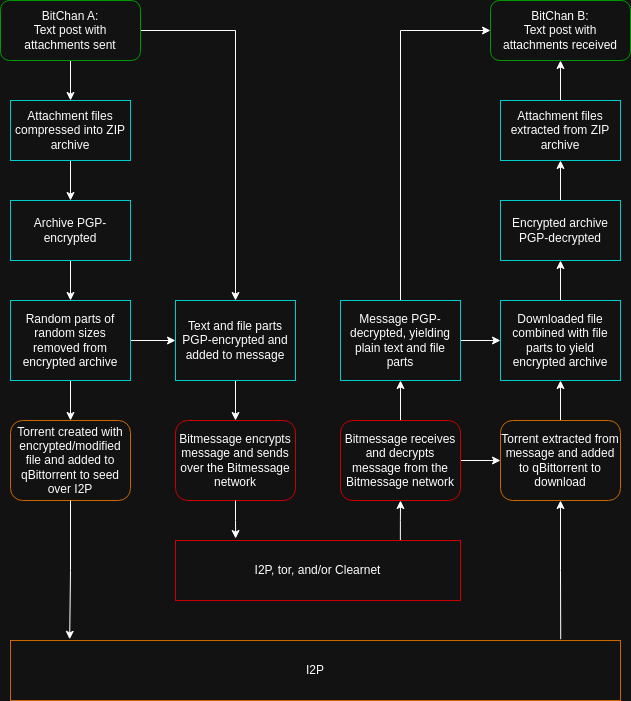

=======
BitChan
=======

Version: 1.4.1

BitChan is a decentralized anonymous imageboard inspired by `BitBoard <https://github.com/michrob/bitboard>`__ and built on top of `Bitmessage <https://bitmessage.org>`__ with `Tor <https://www.torproject.org>`__, `I2P <https://i2pd.website>`__, and `GnuPG <https://gnupg.org>`__.

Anonymous users have set up BitChan instances in `Kiosk Mode <MANUAL.md#kiosk-mode>`__. Check them out at:

 - BitChanr4b64

   - Tor: http://bitchanr4b64govofzjthtu6qc4ytrbuwbgynapkjileajpycioikxad.onion (only accessible with `Tor Browser <https://www.torproject.org>`__).
   - I2P: http://bitchan.i2p, b32 Address http://waycuw2c27ruakfblkf5tcegwmt3ot445dlfoypil6bzmm4yxg7a.b32.i2p (only accessible with `I2P <https://geti2p.net>`__).

 - BitChanp3p

   - Tor: http://bitchanp3p2oevxxb6cxju5lt3dq5xftlvg25ocmdztw7owrz25p7lad.onion (only accessible with `Tor Browser <https://www.torproject.org>`__).
   - I2P: http://lodge.i2p, b32 Address http://jyjyltub7kfusniymuiyis7p2uccgrtrl4ww73zjkdmr433jxb5a.b32.i2p (only accessible with `I2P <https://geti2p.net>`__).

BitChan solves a number of security and free speech problems that have plagued most imageboards. Centralized imageboards can be taken offline or hijacked and can leak user data. BitChan reduces the likelihood of this by being decentralized, allowing each user to host their own instance of the software, requiring all connections to go through Tor/I2P, and not requiring JavaScript.

When installed locally on your computer, BitChan acts as an extension to Bitmessage, a decentralized, blockchain-based messaging program. Bitmessage relies on public key encryption similar to PGP and decentralized message delivery, which due to the fact that every message is distributed to every client, also provides plausible deniability (i.e. no one knows who the message came from or who it was addressed to). Bitmessage handles the sending and receiving of messages and BitChan acts as a sophisticated message processor, which includes a web front end. All communication happens over the Tor onion and i2p networks for anonymity and every BitChan message is encrypted using GPG, an open source version of PGP (Pretty Good Privacy). Instead of connecting to a stranger's server and volunteering potentially identifying information, BitChan anonymously adds your message to the Bitmessage block. Everyone on the Bitmessage network downloads and shares your encrypted messages and only those with the correct keys can decrypt them.

Users of centralized forums often have to deal with overzealous moderators and sometimes even pressure from state powers that tend to suffocate the forum's culture. BitChan's moderation is multifaceted, but to be brief, the option exists to create entirely unmoderatable boards to post content on. Due to its decentralized design, BitChan cannot be moderated by its developers, the government, or any other entity. Indeed, there is no way to disconnect BitChan from the internet, and as long as people are still running Bitmessage, BitChan is completely untouchable. With that said, boards can be created with a variety of rules which allow board owners or admins to moderate them, if desired. Unmoderated boards can always be locally moderated by the user that installs BitChan. Additionally, users can enable Kiosk Mode on their install and enable a Tor Hidden Onion Service or Hidden I2P Service to allow anonymous users to access their instance through .onion and/or .i2p addresses. However, when accessing BitChan in this way, you will be constrained by the particular settings that user chose for their BitChan install. In order to utilize the full features of BitChan, including a complete censorship-free environment, you will need to install it locally on your computer.

BitChan offers boards for a forum-like experience with image and file sharing, lists to organize and share other boards and lists, along with a host of additional features to enhance posts and provide board and list management with the use of owner, admin, janitor, and user permissions. Boards and lists can be public or private, with or without owners or admins, allowing a full range from completely unmoderatable to strictly allowing only select users access.

Quick Links: `Manual <MANUAL.md>`__, `Changelog <CHANGELOG.md>`__, `Screenshots <SCREENSHOTS.md>`__

--------------

.. contents::
   :depth: 4
..

Screenshots & Diagrams
======================

See `Screenshots <SCREENSHOTS.md>`__ for what BitChan looks like running (these are very old at this point, but give an idea of what to expect).

Diagram of how BitChan leverages Bitmessage, tor, I2P, and qBittorrent to communicate securely and privately:

Features
========

- Security
  - All essential functionality without JavaScript
  - All internet traffic (Bitmessage/uploads/downloads/attachments) routed through tor and/or i2p
  - All messages PGP-encrypted with user-selectable ciphers, key lengths, and passphrases

- Board Features
  - Fully anonymous posting, with no identifying information sent
  - Optionally, generate an identity address to post with
  - Threaded posting with text enhancements
  - Attach up to 4 files per post (any file type)
  - Attachments transmitted via BitMessage (<= ~250 KB), I2P/Bittorrent (Unlimited), or 3rd party upload sites (<= ~1 GB)
  - Full-width expansion of Images and videos in posts
  - Overboard, Catalog, Recent, and Search pages
  - Support for post text styles: @@bold@@, \~\~italic\~\~, \_\_underline\_\_, ++strikethrough++, ==big==, \*\*spoiler\*\*, ^s shadow ^s, [meme]meme[/meme], [autism]autism[/autism], [flash]flash[/flash], [aa]ascii art[/aa], and more
  - Support for post text replacements: dice (#3D20), cards (#C5), flip (#flip), 8ball (#8ball), tarot card (#t5), Crowley tarot (#ct5), random book quote (#stich)
  - Support for games: checkers, chess
  - Rules to allow board/list Owners to enable certain board/list-specific features
  - Thread-specific rules, such as require additional proof of work (POW) to post, for mitigating spam
  - Address Book to set labels for addresses that will appear on posts (for those that choose to not post anonymously)
  - Post popup previews for post links (no need to open the link)
  - Live updating of new posts in a thread (no need to refresh the page)
  - Sticky/pin/anchor/sage/+more attributes for threads

- Board and List Ownership and Administration
  - Boards and Lists can have Owners, Admins, White- and Black-listed Users
  - Owners can set a long description, banner and spoiler images, word replacements, and custom CSS
  - Board Owners/Admins can delete threads and posts (affects all users of a board)
  - Board Owners/Admins can ban users from posting (affects all users of a board)
  - Users can block address from posting to one or all boards (only local effects)

- Kiosk mode
  - Allows you to publicly host a BitChan instance in a secure manner
  - Host a tor onion or i2p eepsite services to access your BitChan instance from tor or i2p
  - Options to keep your kiosk completely private for only your use or allow the public to view and/or post
  - Permissions and login system to secure and control access to your BitChan Instance

- Misc
  - Public access where anyone can post on a board or add to a list
  - Private access where only select addresses can post or modify a list
  - Schedule posts to automatically be made in the future, to reduce the likelihood of divulging your time zone
  - Create HTML pages with Jinja2 support, for instance to create a Rules or auto-updating Popular Threads page
  - Mod log to track moderation and other changes
  - Mailbox system for reading and sending using Bitmessage addresses

Install
=======

BitChan runs among several docker containers orchestrated by docker's compose plugin. This allows cross-platform compatibility and a level of isolation of your install from your operating system. For a consistent install environment, installing BitChan within a virtual machine running Xubuntu 22.04 is described below, however you can install BitChan in many operating system of your choice that support the install of docker and docker compose. Alternatively, BitChan can be installed natively in a Debian-based operating system (without Docker). Currently, the only issue you may encounter is selecting an environment that supports the Python2 requirement, as Bitmessage is still in the process of being ported from Python 2 to Python 3. See `INSTALL <INSTALL.md#install-bitchan-without-docker>`__ for detailed native (non-docker) install instructions.

Install BitChan with Docker
---------------------------

Install `Docker Engine and the docker-compose plugin <https://docs.docker.com/engine/install/>`__, then add your user to the docker group.

.. code::

    sudo usermod -aG docker $USER

Log out and back in for the group change to take effect, then change to the BitChan/docker directory and start the build process.

.. code::

    cd BitChan/docker
    docker compose up --build -d

Watch for timeout errors while downloading any of the required files. If the build successfully finishes, BitChan will be accessible at http://172.28.1.1:8000

Install Configuration
~~~~~~~~~~~~~~~~~~~~~

docker-compose.yml in the docker directory can be configured to suit your particular system. Make sure to rebuild from the docker directory with "make daemon" for the changes to take effect.

- The nginx container can have the ports section commented and changed to modify the port used to access the web interface, to change how this port is exposed publicly. When the ports are commented/removed, the web interface can only be accessed from the computer BitChan is installed on.

Post-install
~~~~~~~~~~~~

BitChan will automatically start at boot and runs on port 8000 by default, which can be accessed by visiting http://localhost:8000 or http://172.28.1.1:8000 in a web browser.

For added security, it's recommended to either A) use tor browser or B) configure another browser to connect through tor. This will prevent any potentially malicious connections from accessing the clearnet and exposing your real IP address.

- A: Tor Browser: Install tor browser (``sudo apt install torbrowser-launcher``). Launch tor browser and enter ``about:config`` in the address bar. Search for ``network.proxy.no_proxies_on`` and enter ``172.28.1.1,172.28.1.6,172.28.1.8`` (if installed with docker) or ``127.0.0.1`` (if installed without docker) to exclude the BitChan and I2P Webconsole IP addresses from the proxy. Access BitChan at ``http://172.28.1.1:8000``, the I2P Webconsole at ``http://172.28.1.6:7070``, and the QBittorrent UI at ``http://172.28.1.8:8080`` (use 127.0.0.1 if installed without docker).

- B: Configure your browser to use the Tor SOCKS5 proxy with the host ``172.28.1.2`` and port 9050 (the IP and port for tor running in the tor docker container). Open BitChan at ``http://localhost:8000``.

Verify your browser is using tor by visiting `https://check.torproject.org <https://check.torproject.org>`__.

Install BitChan without Docker
------------------------------

See `INSTALL <INSTALL.md#install-bitchan-without-docker>`__  for how to install BitChan without Docker. Note, these instructions may not always be up to date, so you may need to adapt and overcome challenges.

Upgrade BitChan
---------------

Always read the changelog first to determine if an upgrade can be performed and if there are any actions that must be taken. In a general sense, upgrading BitChan can be performed with the following commands. Any database schema changes will be automatically performed (when possible).

.. code::

    cd BitChan/docker
    sudo docker compose down
    git pull
    sudo make daemon

After a successful build, restart the containers.

.. code::

    docker compose restart

Docker and Control Options
==========================

Backup and Restore BitChan
--------------------------

You can save the settings and data of BitChan and restore it on another machine using a simple file archive. This will preserve everything exactly as it was at the time of archival, including boards, lists, threads, messages, attachments, address book, identities, etc., as well as bitmessage, tor, i2p, and qbittorrent. Stop BitChan running, then execute the following commands. If you are currently running a build of BitChan on the machine you want to restore to, you must first delete the /usr/local/bitchan-docker directory to remove the data from the current install before restoring the data you've backed up. If you used the non-docker install method, you should back up the /usr/local/bitchan directory.

Stop BitChan from running:

.. code::

    cd BitChan/docker
    sudo docker compose down

Create the backup archive:

.. code::

    sudo tar -cvf /bitchan_backup.tar /usr/local/bitchan-docker

Transfer the backup on the second computer, then extract:

.. code::

    sudo tar -xvf /bitchan_backup.tar -C /

Clone and build BitChan on the second computer:

.. code::

    git clone https://github.com/813492291816/BitChan
    cd BitChan/docker
    sudo make daemon

Docker Containers
-----------------

- bitchan_nginx container (BitChan Web User Interface)

  - IP: 172.28.1.1
  - HTTP Port: 8000 - http://172.28.1.1:8000

- bitchan_qbittorrent container

  - IP: 172.28.1.8
  - Webconsole Port: 8080 - http://172.28.1.8:8080
  - The web UI can be used to monitor BitChan I2P torrents as well as add your own I2P torrents. NOTE: The qbittorrent container blocks all connections except to the i2pd container, which only allows i2p torrents to work.
  - Local storage: /usr/local/bitchan-docker/i2p_qb

- bitchan_tor container

  - IP: 172.28.1.2
  - HTTP Proxy Port: 9050
  - Control Port: 9051
  - Local storage: /usr/local/bitchan-docker/tor

- bitchan_i2p container

  - IP: 172.28.1.6
  - HTTP Proxy Port: 4444
  - Webconsole Port: 7070 - http://172.28.1.6:7070
  - Webconsole User/Password: Found in i2pd.conf, run: docker exec -it bitchan_i2p sh -c "cat /home/i2pd/data/i2pd.conf"
  - The default docker-compose.yaml uses purple/i2pd. If you would like to use geti2p/i2p or i2p+, read the instructions in docker-compose.yml that instruct you to comment out the i2pd section and uncomment one of the other i2p sections. Only one i2p container can be enabled at any given time.
  - Local storage: /usr/local/bitchan-docker/i2pd

- bitchan_minode container

  - IP: 172.28.1.10
  - Listen Port: 8446
  - A bridge for Bitmessage to communicate over IP and I2P networks. SOCKS (Tor) needs to be disabled to use.
  - Local storage: /usr/local/bitchan-docker/minode

- bitchan_bitmessage container

  - IP: 172.28.1.3
  - Port: 8445
  - Local storage: /usr/local/bitchan-docker/bitmessage

- bitchan_flask container (frontend)

  - IP: 172.28.1.4

- bitchan_daemon container (backend)

  - IP: 172.28.1.5
  - Local storage: /usr/local/bitchan-docker/bitchan
  - Local storage: /usr/local/bitchan-docker/gnupg

- bitchan_mysql container

  - IP: 172.28.1.7
  - Port: 3306
  - Local storage: /usr/local/bitchan-docker/mysql
  - Access with command: mysql -u root -p -h 172.28.1.7

Docker Volumes
--------------

- docker_flask_session
- docker_run_vol
- docker_var_lock

Adding User to Docker Group
---------------------------

Add your user to the docker group to run docker as a non-root user.

.. code::

    sudo groupadd docker
    sudo usermod -aG docker $USER

Log out and back in for the group addition to take effect.

Make sure you're in the BitChan/docker directory when executing the ``make`` or ``docker compose`` commands.

Build and Daemonize (runs as daemon at startup)
-----------------------------------------------

``make daemon``

Build and Bring Up (output to stdout)
-------------------------------------

``make build``

Stop and delete containers
--------------------------

``make clean``

Bring Down
----------

``docker compose down``

Bring Up (stdout)
-----------------

``docker compose up``

Bring Up (daemon)
-----------------

``docker compose up -d``

Build and Bring Up (stdout)
---------------------------

``docker compose up --build``

Build and Bring Up (daemon)
---------------------------

Note: same as ``make daemon`` command.

``docker compose up --build -d``

Tor Control
-----------

To use nyx to connect to the control port of the containerized tor, run the following from a linux terminal on the system running the docker containers.

.. code::

    sudo apt install nyx
    nyx -i 172.28.1.2:9051

Enter the password saved to /usr/local/bitchan-docker/tor/torpass

Check where ports are bound
---------------------------

.. code::

    sudo netstat -tunlp && sudo lsof -nP -iTCP -sTCP:LISTEN

Connect to a remote server that's bound to localhost
----------------------------------------------------

When a server is bound to localhost, that server can only be connected to from the computer hosting the server (from localhost).

.. code::

    ssh -L local_port:local_address:remote_port user@server.com

For example, if your remote IP address is 123.4.5.6, to connect to the remote i2pd webconsole at port 7070, execute the command:

.. code::

    ssh -L 7777:localhost:7070 user@123.4.5.6

This will send any connection to port 7777 on your local machine over SSH to port 7070 on the remote machine.

After establishing the tunnel, open a web browser to http://localhost:7070.

Kiosk Mode
==========

Installing and running BitChan on a tor or i2p hidden network is very easy and allows BitChan to be publicly accessible. However, as with all public systems, security is a significant concern. Therefore, a Kiosk Mode has been created that institutes a login and permission system to allow administration as well as anonymous but secure usage, including posting, among other features. See the `Kiosk Mode <MANUAL.md#kiosk-mode>`__, `Tor Hidden Onion Service <MANUAL.md#tor-hidden-onion-service>`__, and `Hidden I2P Service (eepsite) <MANUAL.md#hidden-i2p-service-eepsite>`__ sections of the manual for more information.

Installing and Running on a VPS
-------------------------------

Securely log in to the VPS, changing "1.2.3.4" to the VPS IP address and "user" to your user:

.. code::

    torsocks ssh user@1.2.3.4

Then follow the [Docker Install Instructions](#install-bitChan-with-docker).

Before building, if you are going to have this install publicly accessible on the internet, you may want to enable kiosk mode and add an admin user. This can be done by creating an Admin user, then enabling Kiosk Mode, from the configuration menu of the UI. This will require logging in with the Admin password to make changes to the system.

After building and once running, go to http://1.2.3.4:8000 to access the system and check if your password works to log in. If you want to prevent access via the IP address, you will need to first enable a tor hidden onion service or hidden i2p service, then disable the port 8000 for HTTP access in the docker-compose.yaml and rebuild. Alternatively, you can block external access to port 8080 and set up a VPN to access the server remotely. First, enable the tor hidden onion service or hidden i2p service from the Configuration page. After a minute, verify you can connect to the onion and/or i2p addresses listed on the configuration page with tor browser (or eepsite found on the i2p webconsole with a browser configured to use an i2p proxy). Last, disable HTTP access, by editing BitChan/docker/docker-componse.yaml and commenting out the nginx port 8000 in order to disable exposing port 8000.

.. code::

    ports:
      - "8000:8000"

To:

.. code::

    # ports:
    #   - "8000:8000"

Save, then rebuild BitChan:

.. code::

    cd BitChan/docker
    make daemon

Once rebuilt, you should only be able to access BitChan from the hidden onion or i2p addresses. If you want to use a custom onion address, you can generate a v3 onion address and provide the credentials in a zip file. This will allow you to host BitChan on both a randomly-created onion address and a custom vanity address. The random address can be kept private and used for maintenance/testing/administration and the custom address can be given out publicly for users to use the system. The same can be done with i2p by registering a shortened i2p address with a number of i2p registry sites, such as the http://reg.i2p registry service. If you ever need to temporarily disable access to the system, you can disable the custom tor address and keep the random address enabled, and bring down the i2pd docker container, to restrict access to only the random tor address.

Troubleshooting
===============

TODO

Donate
======

Monero Address
--------------

49KE6mo43c6DLuszW48ZkYG8x6KcxjhscY5KzsNLTqLk8Vw2gBaTnoggxfYLJnQ95zNuDpfFESYSFZoucYq5vWAjNrqHbhX

Developer Information
=====================

BitChan GitHub Repository: `github.com/813492291816/BitChan <https://github.com/813492291816/BitChan>`__

Bitmessage Mail: address ``BM-2cWyqGJHrwCPLtaRvs3f67xsnj8NmPvRWZ``

Bitmessage Chan: passphrase "bitchan" without quotes, verify the address is ``BM-2cT6NKM8PZvgkdd8JZ3Z9r9u2sb3jbkCAf``

E-Mail: `BitChan@mailchuck.com <mailto:bitchan@mailchuck.com>`__

*Note: This email can only receive messages. Use Bitmessage for 2-way communication.*

PGP Public Key: `E90B33C4C0E73AF537F2C2E9B14DF20410E5A5BC <https://keys.openpgp.org/vks/v1/by-fingerprint/E90B33C4C0E73AF537F2C2E9B14DF20410E5A5BC>`__
